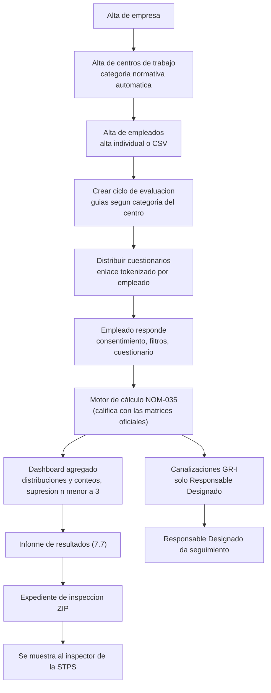
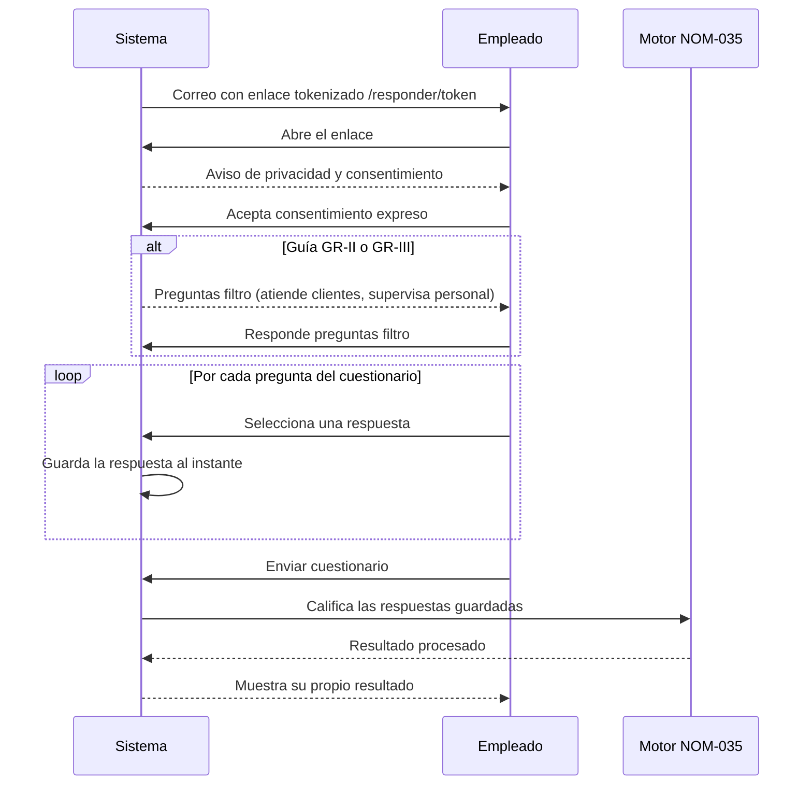
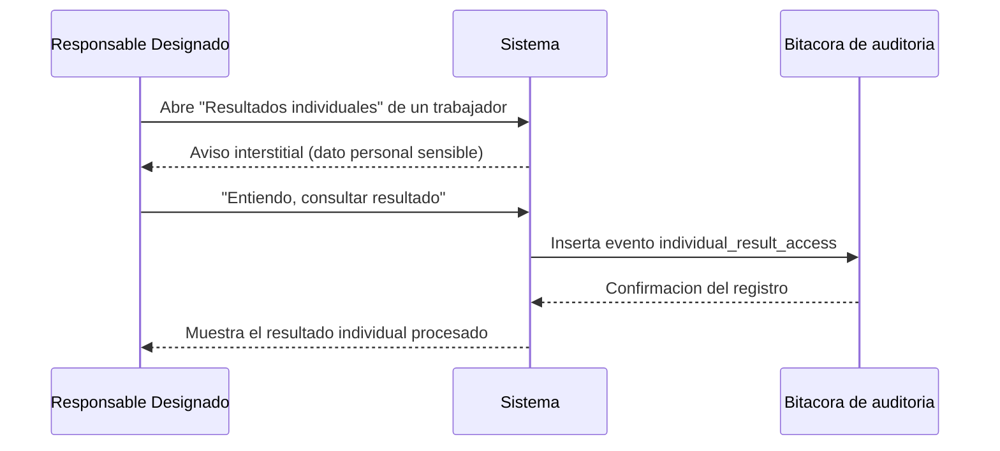

# Manual de uso — Plataforma NOM-035-STPS-2018

Guía completa de la plataforma para quien administra el cumplimiento en su empresa (Admin
de Organización, Consultor externo, Responsable Designado) y para el empleado que responde
el cuestionario. No requiere conocimientos técnicos.

> ¿Buscas el guion rápido de 10 minutos para hacer una demo? Ver [`docs/demo.md`](./demo.md).
> Este manual es la referencia completa; el guion de demo es un recorrido guiado más corto
> sobre los mismos datos.

## Índice

1. [Qué es y cómo funciona](#1-qué-es-y-cómo-funciona)
2. [Cómo fluye el cuestionario del empleado](#2-cómo-fluye-el-cuestionario-del-empleado)
3. [Guía del Administrador](#3-guía-del-administrador)
4. [Guía del empleado](#4-guía-del-empleado)
5. [Prueba end-to-end en local](#5-prueba-end-to-end-en-local)
6. [Portal de operación de plataforma (equipo Constata)](#6-portal-de-operación-de-plataforma-equipo-constata)
7. [Dashboard ejecutivo y asistencia por IA](#7-dashboard-ejecutivo-y-asistencia-por-ia)
8. [Preguntas frecuentes](#8-preguntas-frecuentes)

## 1. Qué es y cómo funciona

La NOM-035-STPS-2018 obliga a todo centro de trabajo en México a identificar y prevenir los
factores de riesgo psicosocial (estrés laboral, jornadas excesivas, violencia laboral, falta
de control sobre el trabajo, entre otros) mediante cuestionarios oficiales, a tomar acciones
cuando se detecta riesgo, y a conservar evidencia de todo el proceso por si la Secretaría del
Trabajo y Previsión Social (STPS) audita a la empresa. No hacerlo, o no poder demostrarlo, es
sancionable con multas de 250 a 5,000 UMA por infracción (art. 994-V de la Ley Federal del
Trabajo). Los resultados de los cuestionarios son datos personales sensibles de salud, así
que la norma —y esta plataforma— exigen que nadie del lado patronal pueda ver una respuesta
individual cruda; solo un "Responsable Designado" puede consultar resultados ya procesados, y
cada consulta se audita.

Esta plataforma digitaliza el ciclo completo: se da de alta la empresa y sus centros de
trabajo (la categoría normativa —qué guías aplicar— se calcula sola según el número de
trabajadores), se cargan los empleados, se abre un ciclo de evaluación, se distribuyen los
cuestionarios por enlace único, cada empleado responde desde su propio dispositivo, el motor
de cálculo oficial califica sus respuestas al instante, y el resultado se agrega en un
dashboard sin promedios ni datos individuales visibles. Al cierre del ciclo, la plataforma
genera el informe normativo de resultados (numeral 7.7) y un expediente de inspección descargable, listos
para mostrarle a un inspector de la STPS.

Todo lo que entra a la base de datos por esta vía —respuestas y resultados— es **inmutable**:
nunca se edita ni se borra. Si algo se corrige o se recalcula, se agrega una fila nueva; el
historial completo queda siempre disponible como evidencia.



## 2. Cómo fluye el cuestionario del empleado

Dos flujos distintos usan el mismo mecanismo de evidencia auditada: el empleado respondiendo
su propio cuestionario, y el Responsable Designado (RD) consultando después un resultado ya
procesado.

### 2.1 El empleado responde su cuestionario



El consentimiento queda registrado con la versión del aviso de privacidad, la fecha/hora y la
IP de origen. Cada respuesta se guarda de inmediato (no hasta el final), así que si el
empleado cierra la pestaña y vuelve con el mismo enlace, retoma exactamente donde se quedó.
La excepción es la Guía I: al no tener ítems condicionales, se salta la pantalla de preguntas
filtro y pasa directo del consentimiento al cuestionario.

### 2.2 El Responsable Designado consulta un resultado individual



Este evento se inserta **en cada consulta**, incluida una simple recarga de la página: no hay
forma de ver un resultado individual sin que quede huella de quién lo consultó y cuándo. Si el
registro de auditoría fallara por cualquier motivo, la plataforma no muestra el resultado
("sin evento no hay consulta").

## 3. Guía del Administrador

Recorrido de las pestañas reales de la plataforma, en el orden en que normalmente se usan.
Aplica igual si entras como **Admin de Organización** o como **Consultor** asignado a la
empresa (ambos pueden gestionar); las diferencias de permisos están en la
[tabla de roles](#312-qué-rol-ve-qué) al final de esta sección.

### 3.1 Ingresar y elegir empresa

Entra en `/ingresar` con tu correo y contraseña. Si trabajas para varias empresas (por
ejemplo, eres consultor de varios clientes), verás "Mis empresas" con la lista completa;
elige la que quieras administrar. Si aún no tienes empresa, "Registrar una empresa nueva"
solo pide razón social y RFC (opcional).

### 3.2 Centros de trabajo

Pestaña **Centros**. Al crear un centro solo indicas nombre, número de trabajadores,
domicilio y actividad principal: la plataforma calcula sola la categoría normativa (qué guías
aplican) a partir del número de trabajadores:

- 15 o menos → solo Guía de Referencia I (GR-I).
- Entre 16 y 50 → GR-I + GR-II.
- Más de 50 → GR-I + GR-III.

Esta categoría se muestra como una etiqueta junto al centro (por ejemplo "GR-I + GR-III
(>50)") y determina automáticamente qué cuestionarios se distribuyen a ese centro.

### 3.3 Empleados

Pestaña **Empleados**. Dos formas de dar de alta:

- **Alta individual**: nombre, correo, área y centro de trabajo, más dos casillas
  ("Atiende clientes", "Supervisa personal") que activan los ítems condicionales de las
  guías Likert.
- **Importación por CSV**: pega el contenido en el cuadro de texto (no se sube archivo,
  se pega texto). El formato exacto, con cabecera obligatoria, es:

  ```
  nombre,email,area,atiende_clientes,supervisa_personal
  ```

  Las columnas `atiende_clientes` y `supervisa_personal` solo aceptan `si` / `no`
  (sin distinguir mayúsculas ni acento en "sí"). El área es opcional (déjala vacía si no
  aplica). Al importar, la plataforma te devuelve un reporte línea por línea: filas con
  cabecera inválida, número de columnas incorrecto, correo con formato inválido, nombre
  vacío, bandera que no es `si`/`no`, correo duplicado **dentro del mismo archivo**, o correo
  que **ya existe en la empresa** — ninguna de esas filas se importa, pero las demás sí, y el
  reporte te dice exactamente cuáles fallaron y por qué para que las corrijas y las vuelvas a
  pegar.

### 3.4 Ciclos de evaluación

Pestaña **Ciclos**. Un ciclo es "la aplicación de la NOM-035 en este centro, en esta fecha".
Al crearlo indicas nombre, centro, fechas y los datos del evaluador (nombre y cédula
profesional — la norma exige poder identificar quién evaluó). Las guías a aplicar se eligen
solas según la categoría normativa del centro. Si un centro no ha tenido una evaluación en
los últimos 24 meses, verás una alerta ("Atención (numeral 7.9): ... sin evaluación en los
últimos 24 meses") arriba de la lista de ciclos.

Dentro de un ciclo verás:

- **Progreso por área**: tabla de completados/pendientes por área — nunca resultados, solo
  conteos de avance.
- **"Distribuir cuestionarios"**: genera el enlace tokenizado de cada empleado del centro
  para las guías que le correspondan y envía el correo (si hay proveedor de correo
  configurado). Es seguro pulsarlo más de una vez: no duplica asignaciones ya existentes.
- **"Enviar recordatorios a pendientes"**: reenvía el enlace únicamente a quien no ha
  terminado. Importante: **genera un enlace nuevo y desactiva el anterior** (rota el token) —
  ver la pregunta frecuente sobre enlaces perdidos.

Las subpestañas del ciclo son:

- **Dashboard agregado**
- **Programa de intervención** (antes "Acciones": Capítulo 8 de la norma)
- **Canalizaciones GR-I** (exclusiva del Responsable Designado)
- **Resultados individuales** (exclusiva del Responsable Designado)
- **Difusión** (constancia de resultados para los trabajadores)
- **Informes y expediente**

### 3.5 Dashboard agregado: qué significa "— (n<3)"

El dashboard muestra tres tablas (calificación final, por categoría, por dominio) con
conteos y porcentajes por nivel de riesgo (Nulo/Bajo/Medio/Alto/Muy alto) y un filtro por
área. Vas a notar dos cosas que son intencionales, no errores:

1. **Nunca hay promedios.** Los resultados de distintos empleados jamás se combinan en un
   promedio; siempre son distribuciones (cuántas personas cayeron en cada nivel).
2. **Las celdas con menos de 3 personas se muestran suprimidas** (verás algo como `<3 *` en
   vez del número). Esto es anti-reidentificación: si un área tiene, por ejemplo, un único
   empleado en nivel "Muy alto", mostrar ese "1" equivaldría a exponer el resultado de una
   persona identificable por descarte. La plataforma incluso protege el caso en que, aunque
   cada celda individual esté bien, la combinación de celdas visibles con el total permitiera
   deducir el valor exacto de las celdas ocultas: en ese caso oculta también otra celda (o el
   total completo del grupo) para que ese cálculo inverso no sea posible. **Es un feature de
   protección de datos personales sensibles, no un defecto.** Cuantas más personas respondan
   y más agregado sea el corte (la tabla global del ciclo, sin filtrar por área), menos
   celdas quedarán suprimidas; al filtrar por área pequeña es normal ver más supresión.

### 3.6 Programa de intervención (Cap. 8), política, capacitación

- **Programa de intervención**: cuando algún resultado vigente del ciclo (calificación
  final, categoría o dominio) cae en nivel **medio, alto o muy alto**, la norma exige un
  Programa de intervención (numerales 8.3 y 8.4; criterios de la Tabla 4 de la Guía II /
  Tabla 7 de la Guía III). La pestaña te lo dice con el criterio literal de la norma por
  nivel detectado y te guía a crearlo: capturas las áreas o trabajadores sujetos (8.4 a) y
  el responsable de la ejecución (8.4 f), y la plataforma **pre-puebla las acciones** que la
  tabla de criterios exige para los niveles encontrados (editables o descartables antes de
  crear). Cada acción lleva nivel de acción del 8.5 (organizacional/grupal/individual),
  áreas, responsable, fecha compromiso, estatus y **evidencia adjunta** (PDF o imagen; se
  registra su huella de integridad). El avance (8.4 d) se ve como "x de y completadas" y el
  documento Programa entra al expediente como PDF con los seis incisos.
- **Política**: publica el PDF de tu política de prevención de riesgos psicosociales (título
  - versión + archivo). Cada empleado la verá al entrar a su cuestionario (si aún no la
    acusó) y podrá registrar su acuse de recibo — esa es tu evidencia de difusión.
- **Capacitación**: sube el contenido de una capacitación y marca manualmente qué empleados
  ya la completaron (checklist con conteo "x/y completados" por contenido).
- **Equipo**: aquí un Admin de Organización puede designarse a sí mismo Responsable Designado
  (requiere capturar su cédula profesional como evidencia) y agregar consultores externos por
  correo (el consultor debe tener ya una cuenta creada). Cualquier miembro ve cuántos
  administradores, Responsables Designados y consultores tiene la empresa.

### 3.7 Difusión de resultados a los trabajadores

La norma obliga a **difundir los resultados** de la evaluación a los trabajadores (numeral
5.7 inciso e) y a que estén **disponibles para su consulta** (numeral 7.8). La pestaña
**Difusión** del ciclo lo resuelve con una **constancia de difusión**:

- Ves una **vista previa** idéntica a lo que verá el trabajador: un resumen en lenguaje
  llano (sin códigos internos) con la participación, la distribución de resultados del grupo
  (con la misma supresión n<3 del dashboard: nada individual sobrevive) y las acciones
  comprometidas.
- Al **publicar**, esa vista previa se congela como constancia sellada con huella SHA-256:
  no se puede editar ni borrar; una corrección es una versión nueva. El historial muestra
  versión, fecha, huella y cuántos trabajadores han acusado.
- Cada trabajador con enlace vigente la ve en su misma liga del cuestionario (después de
  enviarlo, para no sesgar sus respuestas) y puede registrar **"Enterado"** — tu evidencia
  de difusión efectiva. Para quien no tiene enlace vigente, imprime o difunde el contenido
  por otros medios (la norma acepta folletos, boletines o carteles).
- La constancia y sus acuses entran al expediente de inspección.

### 3.8 Buzón de quejas y denuncias

La norma exige **mecanismos seguros y confidenciales** para recibir quejas por prácticas
opuestas al entorno organizacional favorable y denuncias de violencia laboral (numeral 8.1
inciso b), e informar a los trabajadores de que existen (5.7 d). La sección **Buzón** del
menú lateral (visible para gestión y para el Responsable Designado):

- Genera el **enlace del buzón de tu empresa** — difúndelo a toda tu plantilla (correo
  interno, cartel con QR, intranet). El enlace es por empresa, no por persona: **el
  anonimato es técnicamente real**. Puedes rotarlo si se compromete (los enlaces difundidos
  anteriores dejan de servir).
- El trabajador entra **sin cuenta ni sesión**, elige el tipo de reporte, cuenta lo que pasó
  y decide EXPLÍCITAMENTE si se identifica o no. Recibe un **folio y una clave** (se
  muestran una sola vez) con los que puede consultar el estado de su reporte cuando quiera —
  la consulta solo devuelve el estado, nunca re-muestra el contenido.
- En el panel ves la lista solo con metadatos (folio, tipo, estado, fecha). **Abrir una
  queja registra la lectura en la bitácora** (mismo estándar que los resultados
  individuales: sin registro no hay consulta). El seguimiento exige una nota por cada cambio
  de estado (recibida → en revisión → atendida → cerrada), y el trabajador ve esos cambios
  con su folio.
- Al expediente solo entra un **registro agregado** (conteos por tipo, estado y mes): jamás
  el contenido, los folios ni la identidad de nadie.

### 3.9 Acontecimientos traumáticos severos (sección "Eventos traumáticos")

Cuando ocurre un acontecimiento traumático severo —un asalto, un accidente grave, un
fallecimiento, un hecho de violencia— la norma **no espera al ciclo de evaluación**: los
numerales 5.3, 5.5 y 6.5 obligan a aplicar la Guía de Referencia I a quienes lo presenciaron
o lo sufrieron, en cualquier momento del año.

1. En **Eventos traumáticos** → registra el acontecimiento: centro, fecha y descripción **del
   hecho**. Nunca escribas ahí datos de salud ni el estado de una persona: eso es información
   sensible y se recaba con la Guía I. El registro es evidencia y **no se puede editar ni
   borrar**; una corrección se hace registrando un acontecimiento nuevo.
2. En el detalle del acontecimiento → marca a los **trabajadores expuestos** y pulsa "Aplicar
   cuestionario a los seleccionados". Se les envía la Guía I por enlace personal (el correo
   no menciona el acontecimiento). Solo a los seleccionados, no a todo el centro.
3. Quien resulte con necesidad de valoración clínica aparece en las **canalizaciones** que
   atiende el Responsable Designado, con el mismo flujo de siempre.

Estas aplicaciones no cuentan como evaluación del centro: la alerta de reevaluación bienal
(numeral 7.9) sigue su curso, y estos cuestionarios no aparecen en la lista de Ciclos.

### 3.10 Registros del 5.8 (solo el Responsable Designado)

El numeral 5.8 obliga al patrón a **conservar** dos registros con datos de salud por persona.
Ambos se descargan bajo demanda —ante una inspección— y **solo puede generarlos el
Responsable Designado**; cada generación queda en la bitácora de auditoría (si la bitácora
falla, no hay archivo).

- **Registro de resultados (5.8 a)**, en _Resultados individuales_ del ciclo: CSV con la
  calificación final y los niveles por categoría y dominio de cada trabajador. Se registra en
  la bitácora una consulta por **cada** resultado incluido, igual que si los hubieras abierto
  uno a uno.
- **Registro de trabajadores examinados (5.8 c)**, en _Canalizaciones_: CSV de **toda la
  empresa** (evaluaciones y acontecimientos traumáticos, con una columna que dice de cuál
  viene cada renglón): quién presentó acontecimiento, quién requiere valoración y el estatus
  de su canalización.

### 3.11 Informes y expediente

Pestaña **Informes y expediente** del ciclo: dos botones, "Generar informe de resultados
(7.7)" y "Generar expediente de inspección", más un historial descargable de todo lo generado
(tipo, fecha, hash SHA-256 de integridad, botón "Descargar" vía enlace firmado temporal).

- El **informe de resultados** es el que exige el numeral **7.7** de la norma (el 7.9 es la
  periodicidad: reevaluar al menos cada dos años). Es un PDF con: centros evaluados, objetivo
  de la evaluación, principales actividades del centro, método y forma de aplicación (censo,
  cuestionario individual electrónico, condiciones de confidencialidad), distribuciones
  global/por categoría/por dominio (con la misma supresión n<3 que el dashboard), resumen de
  GR-I, conclusiones —incluida la integración al diagnóstico de seguridad y salud en el
  trabajo, numeral 7.6 / NOM-030—, acciones, datos del evaluador y fechas.
- El **expediente de inspección** es un ZIP con TODAS las piezas del ciclo: un `INDICE.txt`
  legible al inicio (qué contiene, qué falta —declarado, nunca omitido en silencio— y la
  huella SHA-256 de cada archivo), el informe en PDF, la política de prevención vigente (o
  la marca explícita "ausente"), los **cuestionarios aplicados sellados** por guía (número y
  texto oficial de cada pregunta, con huella), la **constancia de difusión** con sus acuses,
  el **Programa de intervención** en PDF con su CSV de avances, el **registro agregado del
  buzón** (solo conteos), el **registro de acontecimientos traumáticos** del centro (solo
  conteos por evento), CSVs de evidencia de proceso (acuses de política, participación,
  acciones, capacitación, resumen de auditoría) y un `manifiesto.json` verificable por
  máquina. Es literalmente lo que le muestras a un inspector.

Ninguno de los dos incluye jamás una respuesta cruda ni un resultado por empleado: solo datos
agregados y evidencia de proceso. Los registros del 5.8 —que sí traen datos por persona— son
aparte, exclusivos del Responsable Designado y auditados (3.10).

### 3.12 Qué rol ve qué

|                                                                                                                                                            | Admin de Organización           | Consultor asignado                          | Responsable Designado (flag, sobre cualquier rol) | Empleado (enlace tokenizado)                  |
| ---------------------------------------------------------------------------------------------------------------------------------------------------------- | ------------------------------- | ------------------------------------------- | ------------------------------------------------- | --------------------------------------------- |
| Centros / empleados / ciclos (ver)                                                                                                                         | Sí                              | Sí                                          | —                                                 | No                                            |
| Crear centros, empleados, ciclos; importar CSV; distribuir/recordatorios; registrar acciones; publicar política/capacitación; generar informe y expediente | Sí                              | Sí                                          | —                                                 | No                                            |
| Dashboard agregado, Programa de intervención, Difusión, Informes y expediente (ver)                                                                        | Sí                              | Sí                                          | —                                                 | No                                            |
| Buzón de quejas: ver lista y abrir quejas (lectura auditada) y dar seguimiento                                                                             | Sí                              | Sí                                          | Sí                                                | Presenta y consulta su folio, sin sesión      |
| Publicar constancia de difusión / crear o rotar el enlace del buzón                                                                                        | Sí                              | Sí                                          | No                                                | No                                            |
| Designarse RD / agregar consultores                                                                                                                        | Sí (solo Admin de Organización) | No                                          | No                                                | No                                            |
| Eventos traumáticos: registrar el acontecimiento y aplicar la Guía I a los expuestos                                                                       | Sí                              | Sí                                          | No (solo lectura)                                 | No                                            |
| Registros del 5.8 a) y c) (CSV con datos de salud por persona)                                                                                             | Solo si además tiene el flag RD | No (un Consultor no puede ser designado RD) | Sí, y cada generación se audita                   | No                                            |
| Canalizaciones GR-I (ver y cambiar estatus)                                                                                                                | Solo si además tiene el flag RD | No (un Consultor no puede ser designado RD) | Sí                                                | No                                            |
| Resultados individuales procesados (ver, tras interstitial)                                                                                                | Solo si además tiene el flag RD | No (un Consultor no puede ser designado RD) | Sí, y cada consulta se audita                     | No                                            |
| Respuestas crudas ítem por ítem                                                                                                                            | **Nunca**                       | **Nunca**                                   | **Nunca**                                         | Solo mientras responde su propio cuestionario |
| Su propio cuestionario y su propio resultado                                                                                                               | No aplica                       | No aplica                                   | No aplica                                         | Sí                                            |

Notas sobre esta tabla, derivadas directamente de cómo la plataforma aplica permisos:

- El "Responsable Designado" **no es un rol aparte**: es una designación que se activa sobre
  la membresía de una persona en la empresa, con el botón "Designarme Responsable Designado"
  de la pestaña Equipo. En la demo, por ejemplo, la cuenta RD tiene el rol base "miembro" (sin
  permisos de gestión) más esa designación; también es válido que un Admin de Organización se
  autodesigne RD desde "Equipo" y acumule ambos permisos.
- Un Consultor tiene exactamente los mismos permisos de gestión que un Admin de Organización
  dentro de la empresa a la que está asignado (crear, distribuir, generar informes), salvo
  que no puede designar Responsables Designados ni agregar otros consultores — eso es
  exclusivo del Admin de Organización.
- Nadie del lado patronal —sin excepción de rol— puede leer una respuesta ítem por ítem del
  cuestionario. Esa tabla ni siquiera concede permiso de lectura a usuarios autenticados a
  nivel de base de datos.

### 3.13 Acceso de soporte de Constata (tú tienes el control)

Nadie del equipo de Constata puede ver la información de tu organización por defecto — ni
siquiera para darte soporte. Cuando el equipo necesite revisar algo contigo:

1. **Te llega un correo** con la solicitud: quién (una persona concreta, con nombre y
   correo), para qué (el motivo) y por cuánto tiempo. El correo NO otorga nada: solo lleva
   un enlace a la sección **Soporte** de tu panel.
2. **Tú decides en tu panel.** El formulario llega pre-llenado y te muestra el alcance
   completo antes de confirmar: el acceso es de **solo lectura** (estructura, estados de
   participación, conteos, bitácora), exclusivo para esa persona, con vigencia máxima de
   72 horas (24 por defecto) y revocable en un clic. Solo un Administrador de la
   organización puede otorgarlo.
3. **Lo que el soporte NUNCA ve**, con o sin tu permiso: respuestas de cuestionarios,
   resultados individuales, registros del 5.8 ni el contenido de quejas del buzón. Estas
   reglas no tienen excepciones ni "modo especial".
4. **Todo queda en tu bitácora**: el otorgamiento, cada página que la persona consulta y la
   revocación. Mientras el acceso esté vigente, tu panel lo muestra con un aviso permanente.

Si nadie de tu organización otorga el acceso, el soporte no entra: no existe ningún camino
de excepción del lado de Constata.

## 4. Guía del empleado

Si te llegó un correo pidiéndote responder el cuestionario NOM-035, esto es todo lo que
necesitas saber:

- **Tu enlace es un boleto único, solo tuyo.** Nadie más puede usarlo para responder por ti,
  y tú no necesitas crear ninguna cuenta ni contraseña.
- **Nadie de tu empresa puede ver tus respuestas.** Ni tu jefe, ni Recursos Humanos, ni el
  administrador de la plataforma. Solo una persona —el Responsable Designado— puede ver tu
  _resultado ya procesado_ (no tus respuestas una por una), y cada vez que lo consulta queda
  registrado quién lo hizo y cuándo.
- **Puedes cerrar la pestaña y volver después.** Cada respuesta se guarda apenas la marcas;
  si vuelves a abrir el mismo enlace, vas a encontrar exactamente donde te quedaste.
- **Puedes corregir una respuesta antes de enviar.** Mientras no hayas presionado "Enviar
  cuestionario", puedes regresar a una sección anterior y cambiar lo que quieras.
- **Una vez que envías, ya no se puede editar** — así garantiza la plataforma que tu
  resultado es una evidencia confiable, tanto para ti como para tu empresa.
- **Tu resultado es tuyo.** Al terminar, ves de inmediato tu propio nivel de riesgo. Si el
  cuestionario detecta que viviste un evento traumático severo y conviene una valoración
  clínica, se te dice ahí mismo — no es un diagnóstico, es una recomendación de seguimiento,
  y el Responsable Designado de tu centro se pondrá en contacto para dar seguimiento.
- **Si tu enlace ya no funciona** (expiró o lo perdiste), pide a tu empresa que te reenvíe el
  recordatorio: te llegará un enlace nuevo, el anterior deja de servir.
- **Después de enviar también verás los resultados generales de tu centro** (cuando tu
  empresa los publique): son del grupo, en lenguaje claro, y nunca muestran el resultado de
  una persona. Puedes registrar "Enterado" para dejar constancia de que los consultaste.
- **Si vives o presencias malos tratos o violencia laboral**, tu empresa tiene un **buzón de
  quejas confidencial**: entras sin cuenta, decides si te identificas o reportas de forma
  anónima, y recibes un folio con clave para consultar cómo va tu reporte. El enlace aparece
  en la página de tu cuestionario y tu empresa debe difundirlo también por otros medios.

## 5. Prueba end-to-end en local

Este recorrido asume que ya sembraste los datos de demo. Si no lo has hecho, sigue primero
los prerrequisitos completos de [`docs/demo.md`](./demo.md) (Docker Desktop, `supabase
start`, `.env.local`, `pnpm demo:seed`, `pnpm --filter @nom35/web dev`).

1. **Entra como Admin de Organización** (`admin@demo.nom035.mx` / `DemoNom035!2026`) en
   `/ingresar` y abre la empresa demo.
2. **Recorre el panel administrativo completo**: Centros (categoría normativa automática),
   Empleados (alta individual y CSV), Ciclos (abre "Ciclo 2026" de un centro), Dashboard
   agregado (filtra por área), Programa de intervención, Difusión, Buzón, Política,
   Capacitación, Equipo — así verificas que cada pestaña carga con datos reales.
3. **Copia el enlace `/responder/<token>` de un empleado pendiente.** `pnpm demo:seed`
   imprime en consola el enlace del empleado que se dejó sin completar en cada centro (uno
   por centro). Si ya perdiste esa salida de consola, entra a la pestaña **Ciclos** →
   "Progreso por área" para identificar quién sigue pendiente, y usa "Enviar recordatorios a
   pendientes" para generarle un enlace nuevo (aparecerá en el correo simulado; en local sin
   `RESEND_API_KEY` no se envía nada, pero el token igual se genera y queda activo).
4. **Abre ese enlace en una ventana nueva (o de incógnito)** y responde el cuestionario
   completo: acepta el consentimiento, contesta las preguntas filtro si aplica, responde
   todas las secciones y pulsa "Enviar cuestionario". Verás tu propio resultado de inmediato.
5. **Vuelve al panel como Admin** y confirma que el cambio se refleja: en "Progreso por área"
   ese empleado ya cuenta como completado, y en el Dashboard agregado su nivel de riesgo ya
   forma parte de la distribución (puede hacer que una celda que antes estaba suprimida por
   n<3 ahora se muestre, o viceversa).
6. **Genera el informe 7.7 y el expediente** en "Informes y expediente" del ciclo y descarga
   el ZIP; confirma que el nuevo resultado está reflejado en las distribuciones del PDF.
7. **Verifica la auditoría desde Supabase Studio** (`http://127.0.0.1:54323`, con Supabase
   local corriendo): abre el editor SQL y corre, por ejemplo:

   ```sql
   select event_type, entity, details, created_at
   from audit_log
   order by created_at desc
   limit 20;
   ```

   Deberías ver, entre otros, el evento de la distribución/recordatorio que acabas de usar.
   Para comprobar específicamente el acceso auditado del Responsable Designado, entra ahora
   como `rd@demo.nom035.mx` / `DemoNom035!2026`, abre "Resultados individuales" de cualquier
   trabajador, confirma el interstitial ("Entiendo, consultar resultado"), y vuelve a correr:

   ```sql
   select actor_user_id, details, created_at
   from audit_log
   where event_type = 'individual_result_access'
   order by created_at desc
   limit 5;
   ```

   Recarga la página del resultado individual y vuelve a correr la consulta: debe aparecer
   una fila nueva cada vez, con la misma persona (`employee_id` en `details`) — la prueba de
   que ninguna consulta de un resultado sensible pasa sin dejar rastro.

## 6. Portal de operación de plataforma (equipo Constata)

Superficie exclusiva del equipo de operación, en `/admin`. No existe registro público: el
primer operador se crea con `pnpm operador:crear` (bootstrap manual por entorno) y los
siguientes por invitación desde `/admin/operadores`. Reglas de la casa:

- **Identidad separada.** Una cuenta de operador no puede pertenecer a ninguna empresa (y
  viceversa): la base de datos rechaza la identidad dual. La autorización se resuelve por
  fila real en cada petición — deshabilitar a un operador surte efecto inmediato.
- **MFA obligatorio y fresco.** El portal exige contraseña + código TOTP siempre; sin app
  autenticadora no hay acceso (el alta la fuerza), y cada 4 horas pide re-verificar.
- **Organizaciones.** Alta operada (crea la empresa e invita a su primer administrador por
  correo), suspensión con motivo (el cliente queda en solo lectura CON descarga de su
  evidencia; sus empleados no pueden responder y no se le envía ningún correo),
  reactivación y baja con retención de 90 días (avisos automáticos los días 1, 30, 60 y 85
  para que el cliente descargue su expediente). La purga física es un script manual
  (`scripts/purgar-empresa.mjs`) que exige el plazo vencido, los 4 avisos probados y deja
  un acta con inventario y huellas que sobrevive a la eliminación.
- **Soporte solo con consentimiento.** El operador SOLICITA acceso (correo con deep link al
  panel del cliente); solo un admin del cliente lo otorga, es nominativo (el grant de una
  persona no abre nada a otra), de solo lectura, expira y es revocable. Cada página
  consultada queda en la bitácora del cliente. Sin consentimiento no hay soporte dentro
  del tenant — sin excepciones.
- **Todo auditado.** Cada acto de plataforma queda en la bitácora de plataforma
  (`/admin/bitacora`, filtrable) y, si afecta a una organización, también en la bitácora de
  esa organización.

## 7. Dashboard ejecutivo y asistencia por IA

### 7.1 Dashboard ejecutivo

En cuanto tu organización tiene un ciclo con cuestionarios distribuidos, la página de inicio
del panel deja de mostrar la lista de "primeros pasos" y muestra el **dashboard ejecutivo**
del ciclo activo, pensado para dirección:

- **Avance por centro**: cuántos cuestionarios se completaron de los asignados.
- **Semáforo global y por centro**: la distribución de niveles de riesgo, con la misma regla
  de anonimato del resto de la plataforma — un centro con menos de 3 respuestas aparece
  enmascarado ("—"): grupo pequeño, no reportable. Nunca verás resultados individuales.
- **Pendientes normativos**: cuestionarios sin responder, canalizaciones GR-I abiertas (solo
  el número; el detalle es del Responsable Designado), si falta el Programa de intervención
  cuando los resultados lo exigen, y si falta publicar la política.
- **Próximos vencimientos**: centros que ya deben reevaluarse (bienal, numeral 7.9) y las
  acciones del programa con fecha compromiso vencida o próxima.

### 7.2 Asistencia por IA — qué hace y qué NO hace

La asistencia por IA es **opcional** (se activa por organización) y su regla de oro es simple:
**la IA propone borradores; tú los revisas, los editas y decides si los haces tuyos.** Un
texto de IA nunca se convierte en evidencia por sí solo.

**Qué ve la IA (y qué no):** la IA recibe ÚNICAMENTE los mismos datos agregados que tú ves en
tu dashboard —participación y distribuciones ya anonimizadas (con la supresión de grupos
menores a 3)— más el catálogo de acciones que la norma sugiere. **Nunca** recibe respuestas de
cuestionarios, resultados individuales, los registros del 5.8 ni el contenido del buzón de
quejas. Los grupos pequeños le llegan marcados como "no reportables": no puede inferir el nivel
de nadie.

**Resumen ejecutivo** (en el dashboard): genera un texto en lenguaje de dirección sobre el
panorama del ciclo. Mientras no lo adoptes, se muestra como **BORRADOR sin revisar**, con un
recuadro distinto, y no puede exportarse ni copiarse a ningún documento. Al pulsar "Revisé y
adopto este texto", queda marcado como revisado por ti, con tu nombre y la fecha.

**Plan de acción** (en la pestaña de acciones del ciclo, cuando los resultados exigen
programa): propone medidas concretas, cada una anclada a una acción de la Tabla 4/7 de la
norma (las que se salgan del catálogo se marcan para que las revises con cuidado). Editas cada
medida, marcas cuáles adoptar, y al adoptarlas se agregan a tu Programa de intervención como
acciones tuyas, señaladas como "asistidas por IA". El programa sigue siendo tuyo: editable,
firmado por ti, con la evidencia de siempre.

**Trazabilidad:** cada generación y cada adopción quedan en tu bitácora, y todo texto adoptado
lleva la leyenda de quién lo revisó y cuándo. En un producto de evidencia, el origen del texto
es parte de la evidencia.

## 8. Preguntas frecuentes

**¿Por qué no puedo ver las respuestas individuales de un empleado?**
Porque la norma trata esas respuestas como datos personales sensibles de salud, y la
plataforma lo aplica de forma absoluta: ningún rol patronal (Admin de Organización,
Consultor, Responsable Designado, Admin de Plataforma) puede leer una respuesta cruda ítem
por ítem, sin excepciones. Ni siquiera existe permiso de lectura sobre esa tabla a nivel de
base de datos para usuarios autenticados. Lo único consultable es el **resultado ya
procesado** (nivel de riesgo por categoría/dominio), y solo por el Responsable Designado.

**¿Por qué hay celdas ocultas en el dashboard (`<3 *`)?**
Porque mostrar un conteo de 1 o 2 personas en un grupo pequeño (por ejemplo, un área con
pocos empleados) permitiría, por descarte, identificar el resultado de una persona
específica. La plataforma suprime automáticamente cualquier celda con menos de 3 personas —y
en algunos casos también el total del grupo, si dejarlo visible permitiría deducir el valor
exacto de las celdas ocultas. Es una protección obligatoria (anti-reidentificación), no un
error ni una limitación técnica.

**¿Qué pasa si un empleado pierde su enlace?**
No pasa nada grave: en el ciclo, el Admin (o Consultor) usa "Enviar recordatorios a
pendientes". Eso genera un enlace **nuevo** para ese empleado y desactiva el anterior
(rotación de token) — el enlace viejo deja de funcionar y el nuevo llega por correo. No se
duplica ningún cuestionario ni se pierde ningún avance ya guardado.

**¿Cada cuándo hay que reevaluar?**
La norma (numeral 7.9) exige una nueva evaluación cada 2 años como máximo (antes si cambian
las condiciones de trabajo o hay un evento significativo). La plataforma te avisa
automáticamente en la pestaña de Ciclos cuando un centro lleva más de 24 meses sin una
evaluación nueva.

**¿Qué le muestro a un inspector de la STPS?**
El **expediente de inspección** (ZIP) del ciclo correspondiente, descargable desde "Informes
y expediente". Contiene el informe 7.7 en PDF, la política de prevención publicada, la
evidencia de proceso (acuses de política, participación, acciones de la Tabla 7,
capacitación, resumen de auditoría) y un manifiesto con el hash de integridad de cada
archivo — todo generado a partir de datos agregados y de proceso, nunca de respuestas o
resultados individuales.
